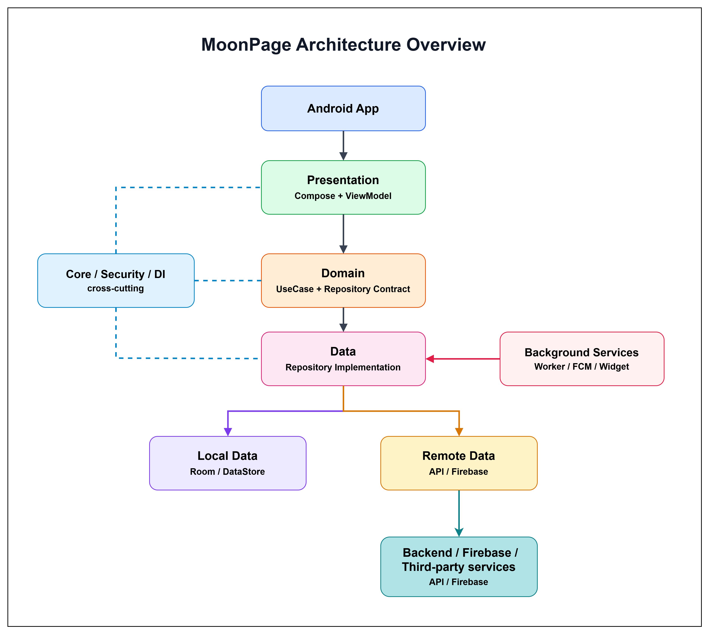

# Kiến trúc tổng quan dự án Moon Page

Moon Page là ứng dụng Android ghi chép nhật ký cảm xúc cá nhân. Dự án được tổ chức theo hướng **Clean Architecture** kết hợp **MVVM** và **Jetpack Compose**. Mục tiêu chính của kiến trúc là tách rõ giao diện, nghiệp vụ và dữ liệu để ứng dụng dễ mở rộng, dễ kiểm thử và dễ bảo trì.

Sơ đồ tổng quan của dự án:

<p align="center">
  
</p>

Luồng chính của hệ thống:

```text
Android App
  -> Presentation
  -> Domain
  -> Data
  -> Local Data / Remote Data
```

Bên cạnh luồng chính còn có hai nhóm thành phần dùng chung: **Core / Security / DI** và **Background Services**. Core cung cấp hạ tầng xuyên suốt cho toàn app, còn Background Services xử lý các tác vụ ngoài màn hình chính như worker, FCM, reminder và widget.

---

## 1. Android App

**Android App** là lớp khởi chạy ứng dụng trên thiết bị Android. Lớp này chuẩn bị môi trường chạy, cấu hình ứng dụng, xử lý vòng đời Android và đưa người dùng vào giao diện Compose.

Trong Moon Page, phần này chịu trách nhiệm cho các tác vụ như khởi tạo Hilt, cấu hình WorkManager, hiển thị splash screen, áp dụng ngôn ngữ đã lưu, xử lý intent từ widget hoặc deep link Spotify, và tạo composable gốc của ứng dụng.

Android App không chứa nghiệp vụ chính. Nó là điểm vào của hệ thống và chuyển quyền điều khiển cho tầng Presentation sau khi app đã sẵn sàng.

---

## 2. Presentation

**Presentation** là tầng giao diện người dùng. Đây là nơi người dùng tương tác với ứng dụng thông qua các màn hình Compose như đăng nhập, lịch nhật ký, ghi nhật ký ngày, khoảnh khắc, thống kê, cửa hàng theme, hồ sơ, cài đặt và widget.

Tầng này sử dụng mô hình MVVM. Compose Screen hiển thị giao diện và gửi sự kiện người dùng đến ViewModel. ViewModel giữ trạng thái màn hình bằng Flow, xử lý sự kiện UI và gọi xuống tầng Domain hoặc repository contract khi cần dữ liệu.

Presentation không trực tiếp biết cách gọi API hoặc lưu dữ liệu vào database. Nó chỉ quan tâm đến trạng thái cần hiển thị, ví dụ dữ liệu đang tải, thao tác thành công, lỗi cần thông báo, hoặc màn hình cần điều hướng tiếp theo.

Các nhóm chính trong tầng này nằm dưới package `ui`, gồm navigation, screens, ViewModel, state/effect và reusable components.

---

## 3. Domain

**Domain** là tầng nghiệp vụ trung tâm. Tầng này mô tả các khái niệm cốt lõi của ứng dụng như người dùng, nhật ký ngày, khoảnh khắc, hoạt động, theme và thống kê.

Domain gồm ba nhóm chính:

- **Domain Model**: biểu diễn dữ liệu nghiệp vụ mà app sử dụng ở các tầng phía trên.
- **UseCase**: biểu diễn một hành động nghiệp vụ cụ thể như đăng nhập, tạo nhật ký, lấy danh sách nhật ký, upload khoảnh khắc hoặc mua theme.
- **Repository Contract**: định nghĩa các thao tác dữ liệu mà tầng Data phải cung cấp.

Điểm quan trọng là Domain không phụ thuộc trực tiếp vào Android UI, Room, Retrofit hay Firebase. Điều này giúp nghiệp vụ của ứng dụng ổn định hơn khi thay đổi giao diện hoặc nguồn dữ liệu.

---

## 4. Data

**Data** là tầng triển khai dữ liệu thật. Tầng này implement các repository contract từ Domain, quyết định dữ liệu được lấy từ local hay remote, đồng thời chuyển đổi dữ liệu giữa DTO, Entity và Domain Model.

Data Layer có ba trách nhiệm chính. Thứ nhất, nó gọi API thông qua Retrofit hoặc SDK tương ứng. Thứ hai, nó đọc và ghi dữ liệu cục bộ qua Room, DataStore hoặc file cache. Thứ ba, nó đồng bộ dữ liệu giữa local và remote để UI có thể phản hồi nhanh nhưng vẫn cập nhật dữ liệu mới từ server.

Ví dụ, với nhật ký ngày, app có thể hiển thị dữ liệu đã cache trong Room trước, sau đó đồng bộ lại với backend. Khi người dùng tạo nhật ký mới, Data Layer có thể cache dữ liệu local để giao diện cập nhật ngay, rồi dùng background worker để upload dữ liệu lên server.

---

## 5. Local Data

**Local Data** là nguồn dữ liệu nằm trên thiết bị người dùng. Moon Page dùng local storage để tăng tốc độ hiển thị, hỗ trợ cache, giữ cấu hình cá nhân và phục vụ widget.

Local Data gồm:

- **Room Database** cho dữ liệu có cấu trúc như daily logs, themes, theme moods, custom themes và statistics.
- **DataStore Preferences** cho token, user info, language, reminder, passcode, theme preference, activity settings, moment cache và widget settings.
- **Internal file cache** cho ảnh nhật ký, ảnh khoảnh khắc, avatar, image cache và HTTP cache.

Local Data đặc biệt quan trọng với các màn hình cần phản hồi nhanh như Calendar, Daily Log, Store, Statistics và các Glance Widget.

---

## 6. Remote Data

**Remote Data** là phần giao tiếp với các hệ thống bên ngoài app. Trong Moon Page, nguồn remote quan trọng nhất là Moon Page Backend API. Backend xử lý xác thực, hồ sơ người dùng, nhật ký ngày, khoảnh khắc, theme, thống kê, hoạt động và thông báo.

Ngoài backend chính, ứng dụng còn tích hợp các dịch vụ bên ngoài như Firebase Cloud Messaging, Spotify API, Weather API, Google Identity, Google Places, Play Services Location và Health Connect.

Trong sơ đồ, Remote Data đại diện cho phần client trong app dùng để gọi ra ngoài. Backend, Firebase và third-party services là các hệ thống bên ngoài được app kết nối thông qua API hoặc SDK.

---

## 7. Core / Security / DI

**Core / Security / DI** là nhóm thành phần dùng chung, tác động xuyên suốt nhiều tầng. Đây không phải tầng nghiệp vụ độc lập, mà là hạ tầng giúp các phần còn lại của ứng dụng hoạt động nhất quán.

Core cung cấp cấu hình network, database, theme, locale, image helpers, date helpers, location, health, speech-to-text, notification và các tiện ích chung. Security bao gồm quản lý token, interceptor gắn token vào request backend, passcode, biometric và các cấu hình bảo mật cục bộ. DI sử dụng Hilt để cung cấp dependency cho Activity, ViewModel, Repository, Worker và Service.

Các module chính gồm network, database, repository binding, use case provider, coroutine scope, widget manager, location và speech manager.

---

## 8. Background Services

**Background Services** là các thành phần chạy ngoài luồng màn hình chính. Chúng không hiển thị UI trực tiếp nhưng vẫn đọc, ghi hoặc đồng bộ dữ liệu với tầng Data.

Moon Page sử dụng WorkManager cho các tác vụ nền như upload nhật ký và kiểm tra thông báo. Firebase Messaging Service nhận push notification từ Firebase. Alarm Receiver tạo nhắc nhở ghi nhật ký theo thời gian người dùng cài đặt. Boot Receiver khôi phục lịch nhắc sau khi thiết bị khởi động lại. Glance Widgets đọc dữ liệu local để hiển thị mood, lịch tuần, lịch tháng, daily summary hoặc ảnh moment ngoài màn hình chính.

Trong sơ đồ, Background Services nối vào Data vì các tác vụ nền thường cần repository, local cache hoặc remote API để hoàn thành công việc.

---

## 9. Luồng dữ liệu chính

Khi người dùng thao tác trên app, luồng xử lý đi qua các tầng như sau:

```text
User action
  -> Compose Screen
  -> ViewModel
  -> UseCase / Repository Contract
  -> Repository Implementation
  -> Local Data hoặc Remote Data
  -> UiState
  -> Compose recomposition
```

Ví dụ khi người dùng tạo nhật ký ngày, Presentation nhận dữ liệu nhập vào và chuyển sự kiện cho ViewModel. ViewModel gọi nghiệp vụ tạo nhật ký. Domain định nghĩa hành động này thông qua use case hoặc repository contract. Data triển khai việc cache dữ liệu vào local storage và upload lên backend. Sau khi dữ liệu thay đổi, UI và widget có thể đọc lại dữ liệu đã cập nhật.

---

## 10. Luồng nền

Một số luồng không bắt đầu từ màn hình người dùng. Ví dụ, Firebase gửi push notification đến thiết bị, AlarmManager kích hoạt reminder, hoặc WorkManager chạy tác vụ upload. Các luồng này đi vào Background Services, sau đó kết nối với Data để đọc local cache, gọi API hoặc ghi lại notification.

```text
System event / Push / Alarm / Widget update
  -> Background Services
  -> Data
  -> Local Data / Remote Data
```

Thiết kế này giúp các tác vụ nền sử dụng cùng tầng dữ liệu với UI, tránh việc mỗi service tự xử lý dữ liệu theo một cách riêng.

---

## 11. Ánh xạ với cấu trúc package

```text
app/src/main/java/com/diary/moonpage/
  core/       Core, Security, DI, utilities, theme, network
  data/       Repository implementations, local database, remote APIs, DTOs
  domain/     Models, repository contracts, use cases
  service/    Workers, Firebase messaging, alarm and boot receivers
  ui/         Compose screens, ViewModels, navigation, components
  widget/     Glance widgets and widget data source
```

Dự án hiện là single-module Android app với module `:app`. Backend không nằm trong repo này; app giao tiếp với backend và dịch vụ bên ngoài thông qua remote APIs.

---

## 12. Kết luận

Kiến trúc Moon Page tách rõ các trách nhiệm chính: Presentation hiển thị và quản lý trạng thái UI, Domain giữ nghiệp vụ và hợp đồng dữ liệu, Data triển khai việc lấy và lưu dữ liệu, Local Data lưu cache trên thiết bị, Remote Data kết nối với backend và dịch vụ bên ngoài.

Core / Security / DI cung cấp hạ tầng dùng chung cho toàn hệ thống. Background Services giúp app tiếp tục xử lý đồng bộ, thông báo, reminder và widget ngay cả khi người dùng không trực tiếp thao tác trên màn hình. Cấu trúc này phù hợp với một ứng dụng Android nhiều tính năng và giúp dự án dễ mở rộng trong các giai đoạn tiếp theo.
